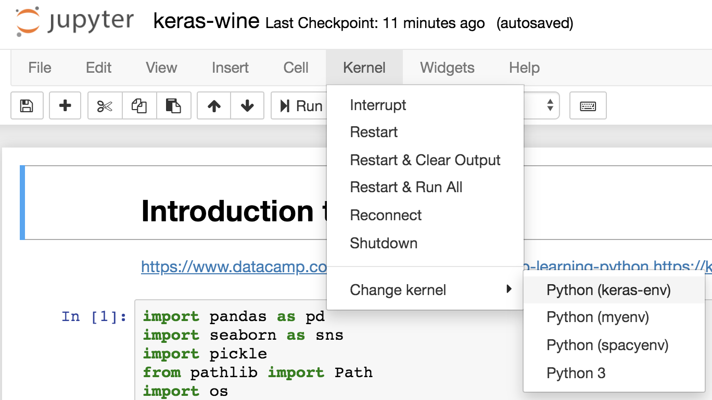

## Introduction to neural nets

[Documentation for Keras](https://keras.io/)
[How to install Keras](https://medium.com/i-want-to-be-the-very-best/installing-keras-tensorflow-using-anaconda-for-machine-learning-44ab28ff39cb)


# Tutorials for learning keras, especially with NLP:

* [Text classification with Keras](https://realpython.com/python-keras-text-classification/)
* [Using Keras to classify wines as red or white](https://www.datacamp.com/community/tutorials/deep-learning-python)
* [Text classification with movie reviews](https://www.tensorflow.org/tutorials/keras/basic_text_classification)
* [Text classification with Reuters dataset](https://towardsdatascience.com/text-classification-in-keras-part-1-a-simple-reuters-news-classifier-9558d34d01d3)
* [Simple classification with 20 newsgroups](https://www.opencodez.com/python/text-classification-using-keras.htm)
* [Using pretrained word-embedding vectors with Keras](https://blog.keras.io/using-pre-trained-word-embeddings-in-a-keras-model.html)
* [Francois Chollet: list of Keras resources](https://github.com/fchollet/keras-resources)


## Installing keras
When working with Keras, it's possible to just install it on your home drive as follows:
```
conda install keras
```
But it's really best practice to install it using a virtual environment, as follows.
```
conda create -n keras-env
conda activate keras-env # on a PC
source activate keras-env # on a Mac
conda install pandas
conda install scikit-learn
conda install matplotlib
conda install seaborn
conda install keras
conda install ipykernel
python -m ipykernel install --user --name keras-env --display-name "Python (keras-env)"
conda deactivate
```
This shuts down your virtual environment. In the future, when you want to work with keras, you'll need to run the following:
```
conda activate keras-env
jupyter notebook
```

And then, in the notebook browser, connect to the new kernel as follows.

